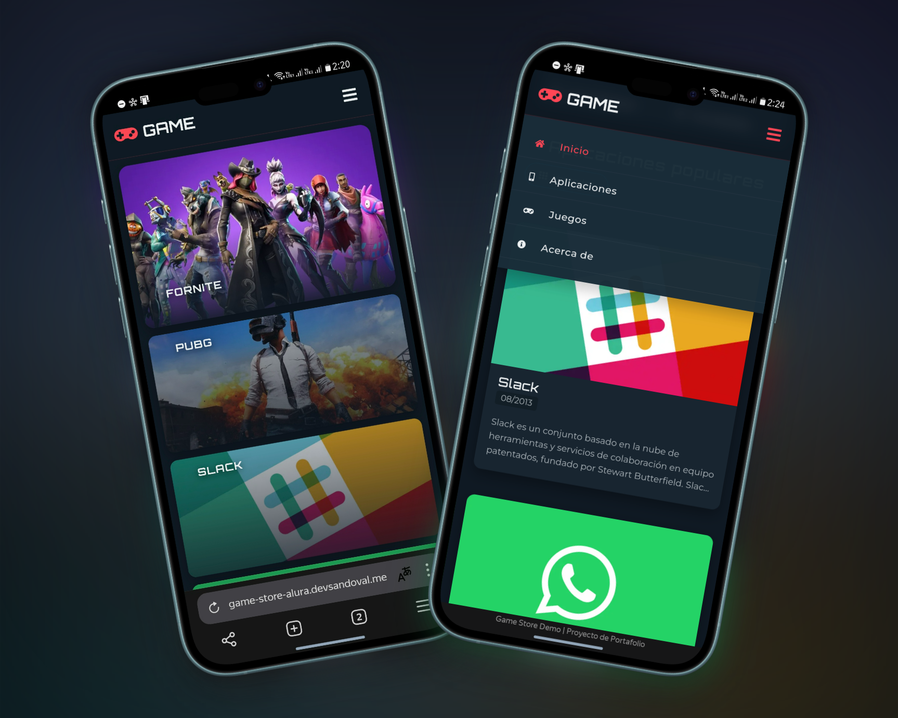

# 🎮 Game Store Alura

<div align="center">
  
  
  
  
  
</div>

**Una landing page moderna para una tienda virtual de videojuegos y aplicaciones**, diseñada para
mostrar diferentes categorías de productos digitales y destacar los títulos más populares del
momento.

---

## 🖼️ Capturas de Pantalla

### Vista de Escritorio


### Vista Móvil

<div align="center">
  
</div>

---

## 📌 Descripción

Game Store Alura es una landing page que presenta una tienda virtual de videojuegos y aplicaciones,
diseñada con un enfoque moderno y atractivo. La página está orientada a mostrar diferentes
categorías de productos digitales, destacando tanto juegos populares como aplicaciones útiles para
el usuario.

> 💡 Este proyecto demuestra el dominio de tecnologías web fundamentales como HTML5 semántico, CSS3
> avanzado y JavaScript, haciendo especial énfasis en técnicas modernas de maquetación como CSS Grid
> y Flexbox. El resultado es un diseño grid responsivo que se adapta fluidamente a diferentes
> tamaños de pantalla, ofreciendo una experiencia visual atractiva donde los usuarios pueden
> explorar productos destacados, filtrar por categorías y descubrir las últimas novedades en juegos
> y aplicaciones.

La página está dirigida a:

-   🎮 Gamers interesados en juegos populares multiplataforma
-   💼 Profesionales que buscan aplicaciones útiles para productividad y comunicación
-   📱 Entusiastas digitales interesados en las últimas tendencias

---

## ✨ Características

-   [x] 🖼️ Diseño moderno con Grid CSS y Flexbox
-   [x] 📱 Totalmente responsivo para dispositivos móviles y de escritorio
-   [x] 🍔 Menú hamburguesa para navegación en dispositivos móviles
-   [x] 🧩 Navegación intuitiva por categorías (Juegos, Aplicaciones, Destacados)
-   [x] 🃏 Tarjetas de producto con información detallada
-   [x] ⭐ Sección de productos destacados con diseño visual atractivo
-   [x] 📋 Información detallada de cada app/juego con fechas de lanzamiento
-   [x] 🔍 Categorización por secciones (Populares, Destacados, Novedades)
-   [x] 🔤 Iconografía clara con Font Awesome
-   [x] ℹ️ Modal informativo de disclaimer al cargar la página
-   [x] 📝 Sección "Acerca de" con información del proyecto
-   [x] 👤 Enlaces a redes sociales en el pie de página

---

## 🛠️ Tecnologías

<div align="center">
  
  
  
  
</div>

### Frontend

-   **HTML5**: Estructura semántica del documento
-   **CSS3**: Estilos modernos con:
    -   CSS Grid para layouts principales
    -   Flexbox para componentes internos
    -   Variables CSS (Custom Properties)
    -   Media queries para diseño responsive
    -   Animaciones y transiciones
-   **JavaScript**:
    -   Funcionalidad del modal de disclaimer
    -   Menú hamburguesa responsivo
    -   Navegación fluida entre secciones

### Herramientas y Bibliotecas

-   **Font Awesome**: Iconografía para la interfaz de usuario
-   **Eric Meyer's Reset CSS**: Para normalización entre navegadores

---

## ⚙️ Instalación

El proyecto es una página web estática, por lo que su instalación es muy sencilla:

```bash
# Clonar el repositorio
git clone https://github.com/sandovaldavid/game-store-alura.git

# Navegar al directorio del proyecto
cd game-store-alura

# ¡Listo! Abre index.html en tu navegador favorito
# O usa un servidor local como Live Server de VS Code
```

### Requisitos

-   Navegador web moderno (Chrome, Firefox, Safari, Edge)
-   Opcional: Servidor local para desarrollo (Live Server, http-server)

---

## 🚀 Uso

La landing page está diseñada para ser intuitiva:

1. Navega entre las diferentes secciones utilizando el menú superior
2. Explora los productos destacados en la sección principal
3. Desplázate hacia abajo para ver las diferentes categorías:
    - Aplicaciones populares
    - Juegos populares
    - En Destaque (destacados)
    - Novedades
4. Cada tarjeta de producto muestra:
    - Imagen del juego o aplicación
    - Título del producto
    - Fecha de lanzamiento
    - Descripción del producto

---

## 📁 Estructura del Proyecto

```
📦 game-store-alura
 ┣ 📜 index.html                  # Página principal del sitio
 ┣ 📄 Prototipo.pdf               # Documento con el diseño original
 ┣ 📄 README.md                   # Documentación del proyecto (este archivo)
 ┣ 📂 assets                      # Recursos del proyecto
 ┃ ┣ 📂 css                       # Archivos de estilos
 ┃ ┃ ┣ 📄 reset.css               # Normalización de estilos
 ┃ ┃ ┣ 📄 style.css               # Estilos principales
 ┃ ┃ ┣ 📄 destacado.css           # Estilos para sección destacados
 ┃ ┃ ┣ 📄 menu.css                # Estilos para el menú
 ┃ ┃ ┣ 📄 populares.css           # Estilos para secciones populares
 ┃ ┃ ┗ 📄 responsivo.css          # Media queries para responsive
 ┃ ┣ 📂 img                       # Imágenes de juegos y aplicaciones
   ┗ 📂 js                        # JavaScript
   ┗ 📄 fontawesome.all.min.js    # Biblioteca Font Awesome
```

### Descripción de Componentes Clave

-   **CSS Modular**: Cada archivo CSS tiene una función específica, facilitando el mantenimiento
-   **Estructura HTML**: Organizada por secciones para facilitar la navegación
-   **Documentación**: Archivos markdown detallando aspectos del proyecto

---

## 🤝 Contribuciones

Las contribuciones son bienvenidas para mejorar este proyecto. Sigue estos pasos:

1. 🍴 Haz un fork del proyecto
2. 🌿 Crea una rama para tu mejora (`git checkout -b feature/nueva-mejora`)
3. 💾 Haz commit de tus cambios (`git commit -m 'Agrega nueva mejora'`)
4. 📤 Sube tus cambios (`git push origin feature/nueva-mejora`)
5. 📩 Abre un Pull Request

---

## 🪪 Licencia

Este proyecto está bajo la Licencia MIT - consulta el archivo [LICENSE](./LICENSE) para más
detalles.

---

## 👨‍💻 Autor

### [David Sandoval](https://github.com/sandovaldavid)

-   🌐 Portafolio: [devsandoval.me](https://devsandoval.me)
-   💼 LinkedIn: [@devsandoval](https://linkedin.com/in/devsandoval)
-   💻 GitHub: [@sandovaldavid](https://github.com/sandovaldavid)
-   📧 Email: [contact@devsandoval.me](mailto:contact@devsandoval.me)

---

<div align="center">
  <p>
    <small>Desarrollado como parte del curso de Frontend en Alura - 2022</small>
  </p>
  
</div>
